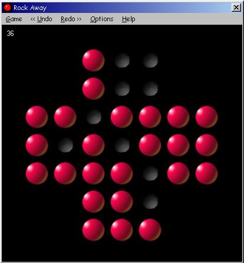



## Rock Away

### Description

Rock Away is a very addictive boardgame with a simple goal: play until only one rock remains in the center of the screen. Simple goal, hard game! If you start losing hope to find a solution, let me tell you this: I first saw the game with a street vendor in Tunesia, who showed me 4 solutions in a nick of time. He told me he knew 12 solutions. I bought the game, believing this was a piece of cake, and spend 2 days finding one solution! I now have great respect for that poor man. I challenge everyone to seek all solutions. Good luck (and lots of time and little sleep). Update 12/8: rewrote game routine (less code) and small undo-routine bug.
 
### More Info
 

             |
---                |---
**Submitted On**   |2005-12-03 18:14:12
**By**             |[D\. Rijmenants](https://github.com/Planet-Source-Code/PSCIndex/blob/master/ByAuthor/d-rijmenants.md)
**Level**          |Beginner
**User Rating**    |5.0 (15 globes from 3 users)
**Compatibility**  |VB 5\.0, VB 6\.0
**Category**       |[Games](https://github.com/Planet-Source-Code/PSCIndex/blob/master/ByCategory/games__1-38.md)
**World**          |[Visual Basic](https://github.com/Planet-Source-Code/PSCIndex/blob/master/ByWorld/visual-basic.md)
**Archive File**   |[Rock\_Away1955071282005\.zip](https://github.com/Planet-Source-Code/d-rijmenants-rock-away__1-63470/archive/master.zip)

